# Section 09.2: Fisheye Camera Calibrarion

A fisheye camera is a pinhole camera equipped with a fisheye lens. Normally, pictures taken by a fisheye camera are extremely distorted. OpenCV documentation [Fisheye camera model](https://docs.opencv.org/4.2.0/db/d58/group__calib3d__fisheye.html) provides plenty of functions to deal with **Fisheye cameras**. 


In this chapter, our experiments are tested on [Jevois](http://jevois.org) with its [120-degree fisheye lens](https://www.jevoisinc.com/products/jevois-1-3mp-sensor-with-120deg-fisheye-lens) for fisheye calibration.

```console
➜  ~ lsusb
......
Bus 001 Device 010: ID 1d6b:0102 Linux Foundation EEM Gadget
......
```

Again, our test are based on a chessboard pattern and a cirle-grid pattern, but with a fisheye camera.

[Activity09.03.py](../Activity09.03/Activity09.03.py) provides a code snippet for fisheye camera calibration using a chessboard.

The following 10 experimental images demonstrate the chessboard corner finding performace.

|   Column 1   |      Column 2 | 
|:----------:|:----------:|
| 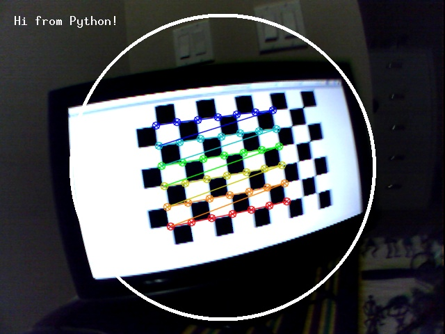 | 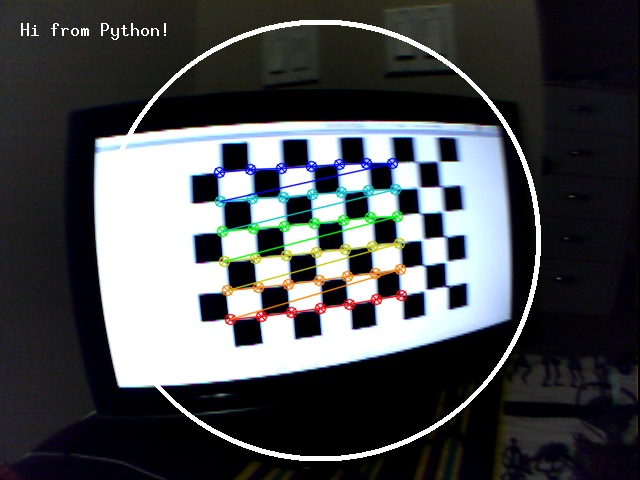 |
| 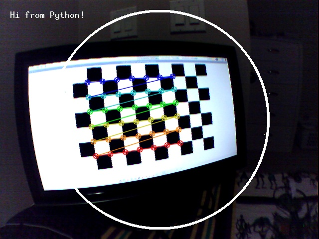 | 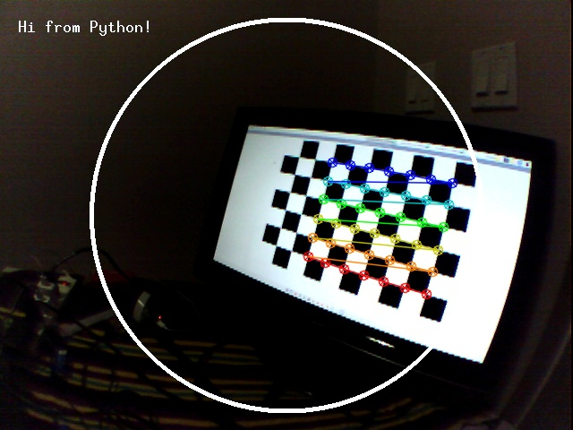 |
| 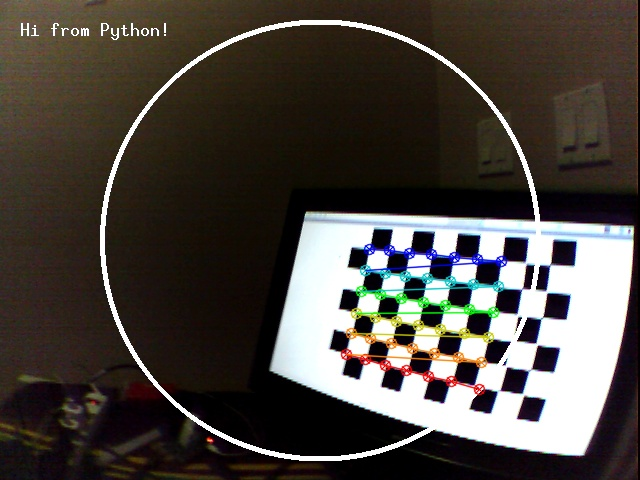 | 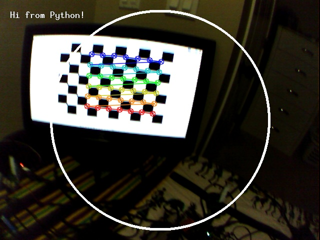 |
| 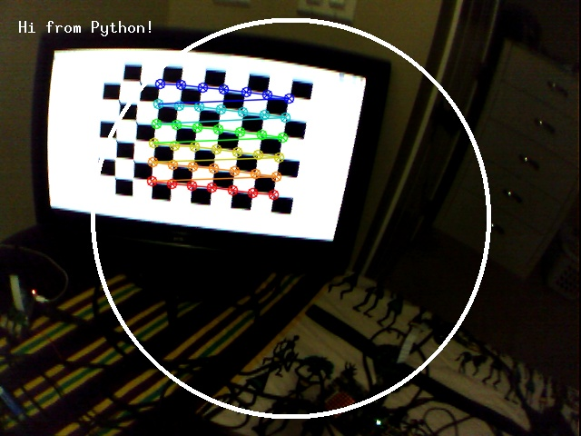 | 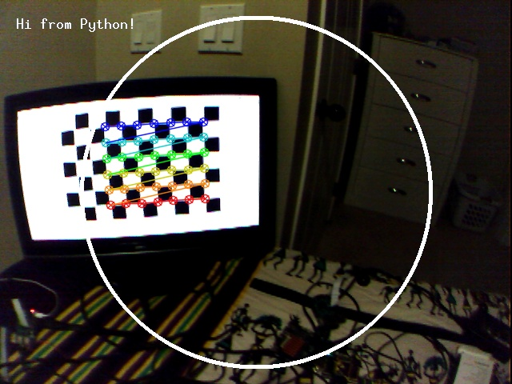 |
| 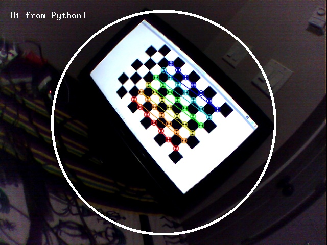 | 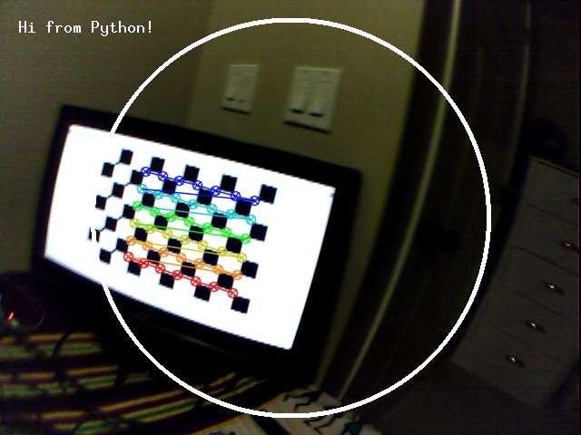 |

And the resultant calibration matrix is calculated as in this [calibration.yml](chessboard/calibration.yml).


[Activity09.04.py](../Activity09.04/Activity09.04.py) provides a code snippet for fisheye camera calibration using an asymmetrical circle pattern.

Similar to [Activity09.03.py](../Activity09.03/Activity09.03.py), calibration can also be done using circle grids. 10 experimental images clearly demonstrate the performance to find the circle centers.

|   Column 1   |      Column 2      |
|:----------:|:----------:|
| 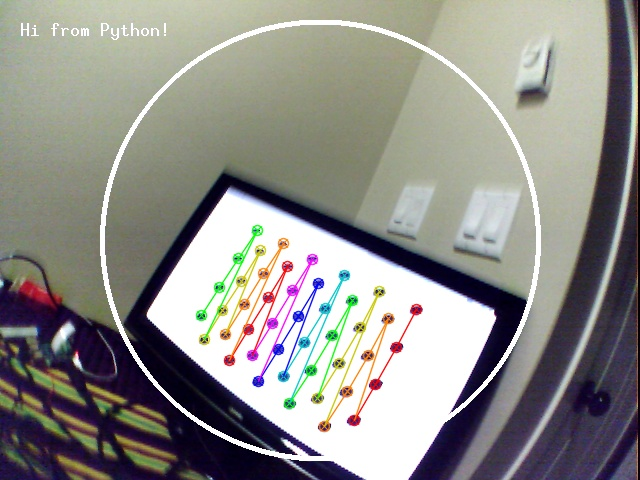 | 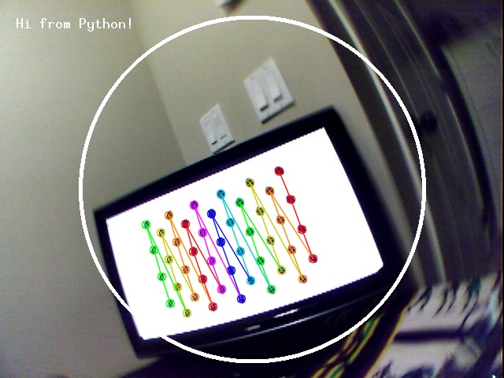 |
| 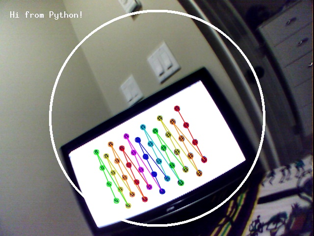 | 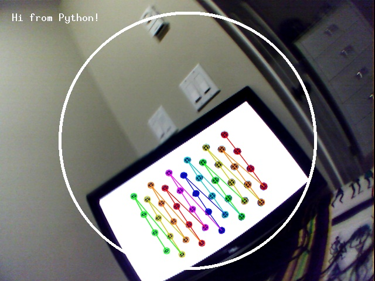 |
| 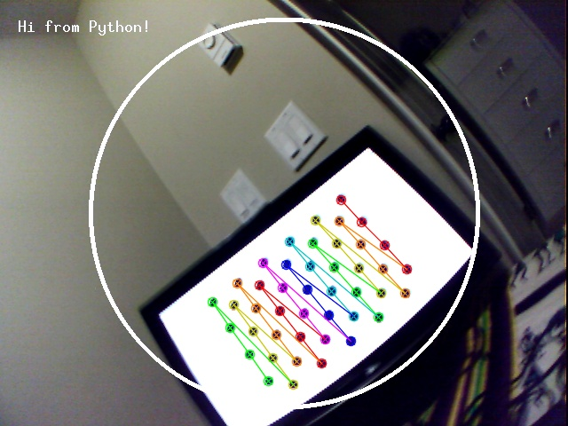 | 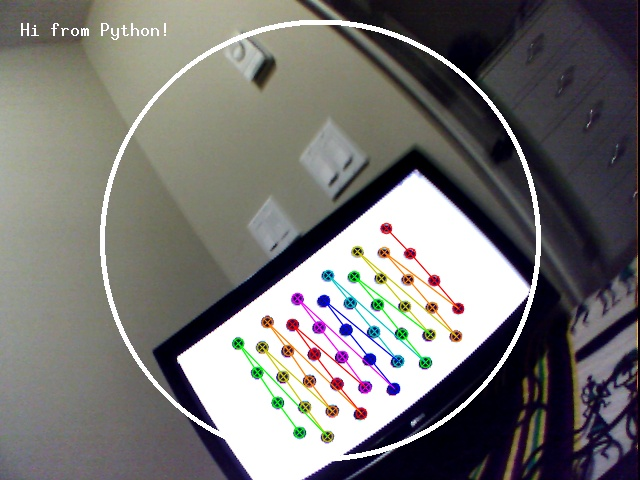 |
| 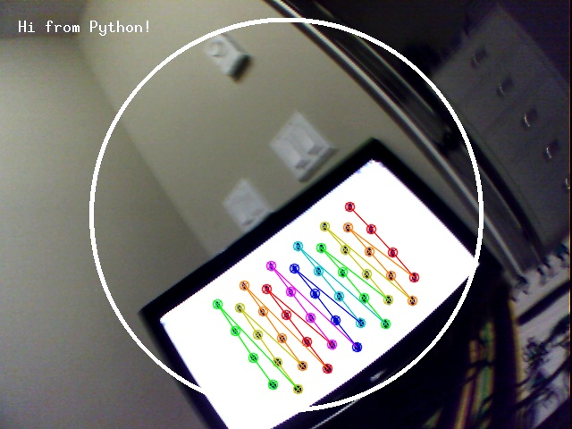 | 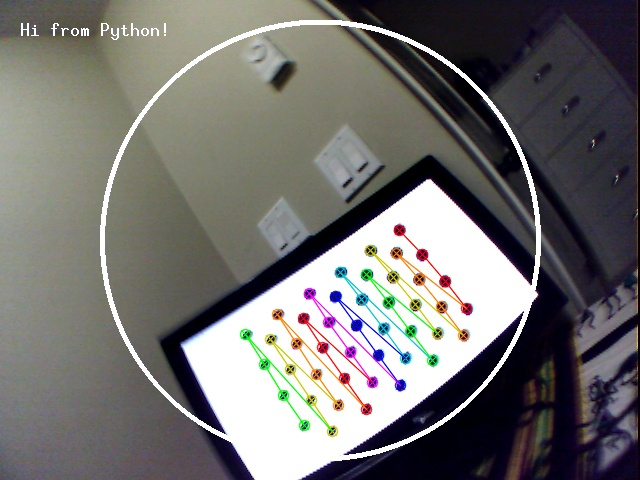 |
| 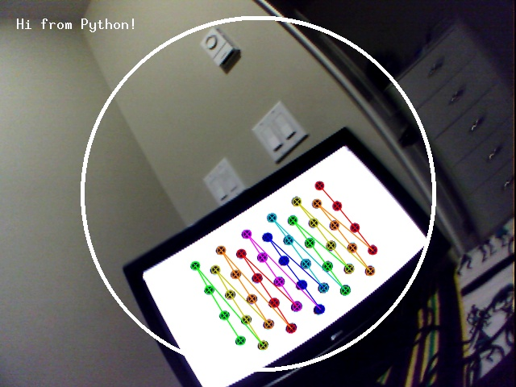 | 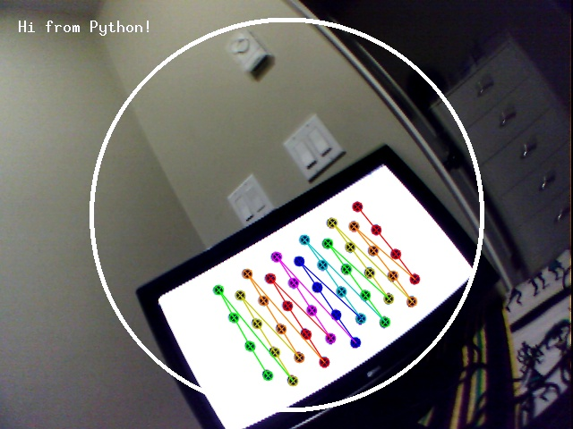 |

The resultant calibration matrix is estimated as in this [calibration.yml](circlegrid/calibration.yml).


**VERY IMPORTANT**<br/>
Compared to the previous two implementations: [Activity09.01.py](../Activity09.01/Activity09.01.py) and [Activity09.02.py](../Activity09.02/Activity09.02.py), [Activity09.03.py](../Activity09.03/Activity09.03.py) and [Activity09.04.py](../Activity09.04/Activity09.04.py) have only two major differences:

- cv2.calibrateCamera to cv2.fisheye.calibrate
- input data objpoints must be in 3 dimension.

